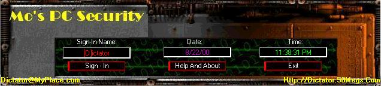



## Mo's SUPER PC Security\! \(Xtremely Advanced Security Progam\)

### Description

This program was UPDATED AS OF 9/16/2000! Every single last

line is commented greatly!!!

This is a cool unfinished app that I wrote around 3 months ago!

This not only shows all of the INs and OUTs of PC Security

programming, it also has a great Graphical User Interface and

many cool effects. This is code is for making a program

that keeps the users out until they sign in. It then creates

a hidden System file which is only accessible through the

Client Control Panel included in this package with Full source.

All this and more packed down to less than half the original size!!!

It is now 130Kb!!!! Great download, please vote

if you like this submission.

NOTE: My last version did not have a screenshot

included and had some errors. It was also very

big and barely commented, so that is why I

deleted it and resubmitted
 
### More Info
 

             |
---                |---
**Submitted On**   |2000-09-16 00:15:36
**By**             |[M  Kaleel](https://github.com/Planet-Source-Code/PSCIndex/blob/master/ByAuthor/m-kaleel.md)
**Level**          |Intermediate
**User Rating**    |4.5 (94 globes from 21 users)
**Compatibility**  |VB 5\.0, VB 6\.0
**Category**       |[Miscellaneous](https://github.com/Planet-Source-Code/PSCIndex/blob/master/ByCategory/miscellaneous__1-1.md)
**World**          |[Visual Basic](https://github.com/Planet-Source-Code/PSCIndex/blob/master/ByWorld/visual-basic.md)
**Archive File**   |[CODE\_UPLOAD99249162000\.zip](https://github.com/Planet-Source-Code/m-kaleel-mo-s-super-pc-security-xtremely-advanced-security-progam__1-11366/archive/master.zip)

